# Pipeline handoff: raw → clean → index → evaluate → report

Sơ đồ này mô tả contract bàn giao dữ liệu giữa các stage của baseline pipeline. Các đường dẫn artifact lấy từ `src/core/config.py`; các bước orchestration dự kiến được gọi từ `src/pipelines/phase1.py`.

```mermaid
flowchart LR
    SOURCE["Crossref REST API<br/>GET /works<br/>query + filter + rows=24"]

    subgraph RAW["1. RAW — Source ingestion"]
        FETCH["fetch_source_records()<br/>request · timeout · retry/backoff"]
        RESPONSE[("data/raw/<br/>crossref_response.json")]
        PARSE["parse_crossref_payload()<br/>Crossref items → PaperRecord"]
        RECORDS[("data/raw/<br/>crossref_records.json")]
    end

    subgraph CLEAN["2. CLEAN — Cleaning & data modeling"]
        NORMALIZE["build_clean_dataframe()<br/>normalize · validate · deduplicate<br/>published · age_days · text_for_embedding"]
        CLEAN_CSV[("data/clean/<br/>papers_clean.csv")]
        CLEAN_JSON[("data/clean/<br/>papers_clean.json")]
    end

    subgraph INDEX["3. INDEX — Embedding & vector store"]
        DOCUMENTS["Document contract<br/>paper_id · title<br/>content · metadata"]
        EMBED["MiniLMEmbeddings<br/>all-MiniLM-L6-v2"]
        CHROMA[("data/chroma/<br/>papers-baseline")]
        MANIFEST[("data/embeddings/<br/>papers_embeddings.json")]
    end

    subgraph EVALUATE["4. EVALUATE — Fixed test set & scoring"]
        TESTSET[("data/eval/test_set.json<br/>question · ground_truth<br/>ground_truth_doc_ids · question_type")]
        RETRIEVE["answer_question()<br/>exact lookup + top-k semantic search"]
        SCORE["evaluate_pipeline()<br/>retrieval hit · token F1<br/>judge · optional Ragas"]
        METRICS[("data/results/<br/>baseline_metrics.json")]
        ANSWERS[("data/results/<br/>baseline_answers.json")]
    end

    subgraph REPORT["5. REPORT — Observability & evidence"]
        QUALITY["run_data_quality_checks()<br/>count · null · uniqueness<br/>summary length · age"]
        FRESHNESS["build_freshness_report()<br/>latest · oldest · stale rows"]
        QUALITY_FILES[("data/quality/<br/>quality + freshness JSON")]
        MARKDOWN[("data/reports/<br/>phase1_report.md")]
    end

    SOURCE --> FETCH
    FETCH -->|"raw JSON payload"| RESPONSE
    RESPONSE --> PARSE
    PARSE -->|"List[PaperRecord]"| RECORDS

    RECORDS -->|"paper_id, title, summary,<br/>authors, categories, dates, URLs"| NORMALIZE
    NORMALIZE --> CLEAN_CSV
    NORMALIZE --> CLEAN_JSON

    CLEAN_CSV -->|"text_for_embedding + metadata"| DOCUMENTS
    DOCUMENTS --> EMBED
    EMBED --> CHROMA
    CHROMA --> MANIFEST

    CLEAN_CSV -->|"build once"| TESTSET
    TESTSET --> RETRIEVE
    CHROMA -->|"top-k contexts"| RETRIEVE
    RETRIEVE --> SCORE
    TESTSET -->|"ground truth"| SCORE
    SCORE --> METRICS
    SCORE --> ANSWERS

    CLEAN_CSV --> QUALITY
    CLEAN_CSV --> FRESHNESS
    QUALITY --> QUALITY_FILES
    FRESHNESS --> QUALITY_FILES
    METRICS --> MARKDOWN
    ANSWERS --> MARKDOWN
    QUALITY_FILES --> MARKDOWN
```

## Contract bàn giao

| Handoff | Input | Điều kiện bàn giao | Output/artifact | Consumer |
|---|---|---|---|---|
| Source → Raw | Crossref `/works` response | HTTP thành công; raw response được lưu trước khi biến đổi; parse chịu được field thiếu | `crossref_response.json`, `crossref_records.json` | Cleaning |
| Raw → Clean | `List[PaperRecord]` | Có `paper_id`, `title`; text/date/list được chuẩn hóa; duplicate và row không hợp lệ được xử lý | `papers_clean.csv`, `papers_clean.json` | Index, test-set builder, quality checks |
| Clean → Index | Clean dataframe | Có `paper_id`, `title`, `text_for_embedding` và metadata cần cho trả lời | Chroma collection `papers-baseline`, `papers_embeddings.json` | Retrieval/evaluation |
| Index → Evaluate | Chroma index + test set cố định | Mỗi sample có `question`, `ground_truth`, `ground_truth_doc_ids`, `question_type`; query trả về top-k document IDs và contexts | `baseline_metrics.json`, `baseline_answers.json` | Reporting/comparison |
| Evaluate → Report | Metrics, answer evidence, clean dataframe | Quality/freshness được tính trên đúng dataset của metrics; số liệu trong Markdown khớp JSON artifact | Quality/freshness JSON, `phase1_report.md` | Người chấm và corruption flow |

## Các metric được chuyển sang report

- `retrieval_hit_rate`: tỷ lệ câu hỏi có ít nhất một ground-truth document trong top-k.
- `mean_token_f1`: độ trùng token trung bình giữa answer và ground truth.
- `judge_accuracy`: tỷ lệ answer được judge đánh giá đúng.
- `mean_judge_score`: điểm judge trung bình trên thang 1–5.
- `ragas`: đánh giá bổ sung, chỉ chạy khi bật `RUN_RAGAS=1`.
- Quality/freshness: row count, null/unique IDs, title/summary validity, stale rows và trạng thái fresh/stale.

## Liên hệ Rubric

| Stage | Mục Rubric | Điểm cơ bản |
|---|---|---:|
| Toàn pipeline | Code structure và project organization | 10 |
| Raw | Raw data ingestion | 15 |
| Clean | Cleaning và data modeling | 15 |
| Index | Embedding và vector store | 10 |
| Index/Evaluate | Agent và multi-provider LLM | 10 |
| Evaluate | Evaluation và scoring | 10 |
| Report | Data observability | 10 |
| Nhánh sau baseline | Corruption và comparison | 10 |

> Lưu ý: đây là kiến trúc/contract mục tiêu của starter. Tại thời điểm lập sơ đồ, các module ingestion, cleaning, test-set, observability, reporting và orchestration vẫn chứa `TODO(student)`/`NotImplementedError`, nên chưa thể coi các artifact trên là đã được tạo thành công.
